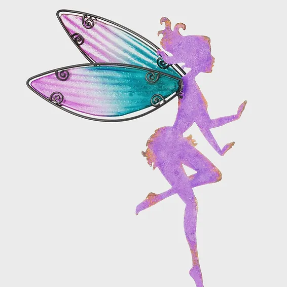

Un regard a suffi.

À sa vue, je fut à Elle et elle fut à moi.

Elle l'ignorait, je l'avoue , mais elle m'avait atteint.

Je m'en souviendrai de ce jour, j'en ai déjà parlé, j'en parlerai encore, mais je sais qu'un jour je me terai.

Ça a longtemps durée, mais pas suffisamment, pas comme je le voulais.

Elle l'ignorait. Mais elle était à moi.

Son avis ? ! Qui sait ? Je lui pas demandé. Elle était à moi et ça me suffisait. Même si elle l'ignorait.

Elle l'était, je vous l'assure, du moins c'est ce que je croyais. Mais en me rapprochant d'elle, elle reculait.

Je lui courait après, j'accelerais le pas, je prenais mon Souffle, adaptait ma course et lui courait après.

J'ai jamais cessé de courir, mais je l'ai jamais dépassé, parce qu'elle à son tour, courait plus vite que moi.

Tel un mirage, elle était là, belle , pleine d'espoir.

Tel l'horizon, elle m'encourageait mais fut inatteignable.

J'ai courut, je vous l'assure, dumoins, je croyais.

Mais quand le mirage s'éteint, que l'horizon disparait, n'est-ce​ pas cela le vrai désespoir ?

Que sais je ?

J'ai trop penser ! Trop planifier ! Trop interpréter !

Je me suis pris un râteau et le mur avec !

J'apprends peu à peu à apprécier la soupe, car j'y ai perdu des dents.

J'apprends pas à pas, à reprendre la course car Cupidon m'a flécher le talon.

J'attends, j'apprends, j'avance en tout cas... Et c'est bien suffisant.
