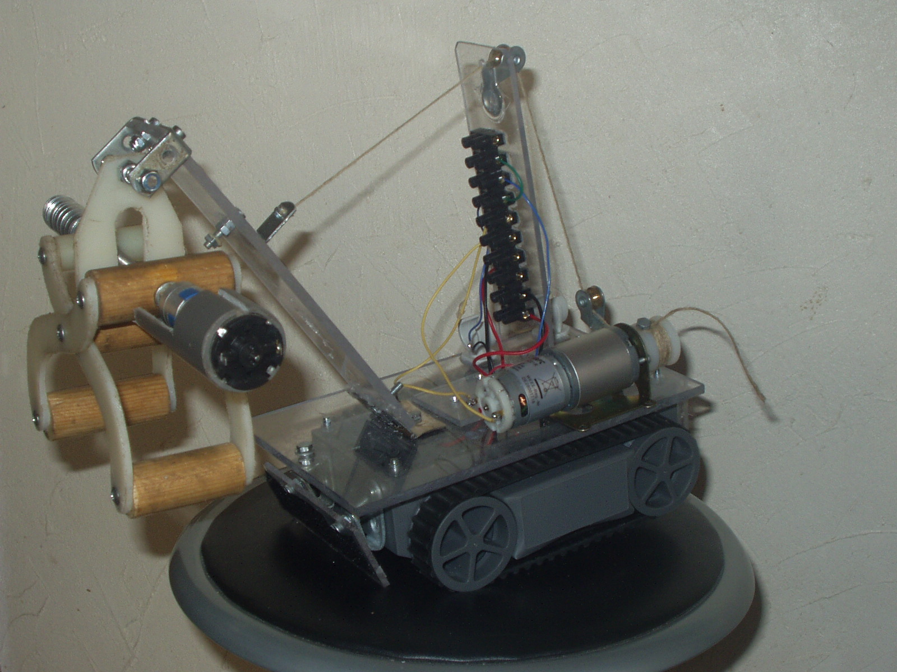

Summary
-------

My first encounter with robotics, in 10th grade. 

This is a RC 'robot' made in my basement for a French competition.  Each actuator (gripper, lever, both track motors) is controlled and powered by a controller box with a simple joystick-style switch and pushbuttons.

This was how they did it in the school's robotics club before, and I didn't know at the time what microcontrollers were.

We built another one using an Arduino the year after: [Crawl-bot-2](https://www.instructables.com/id/Joystick-controlled-Robot/)

Pictures
--------

