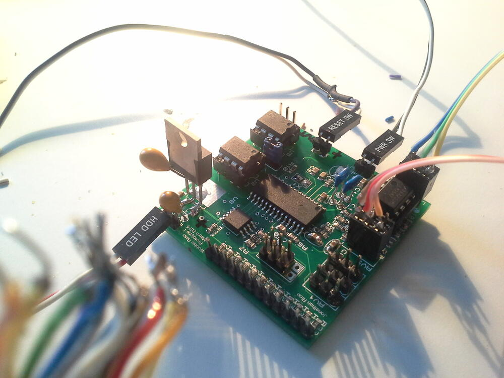
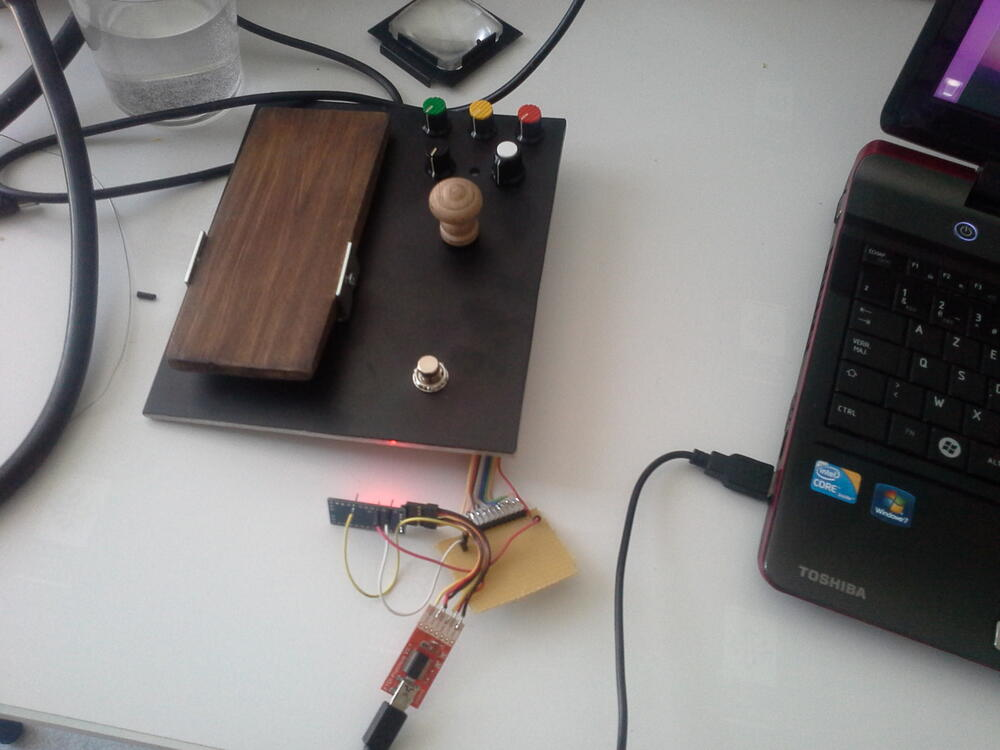
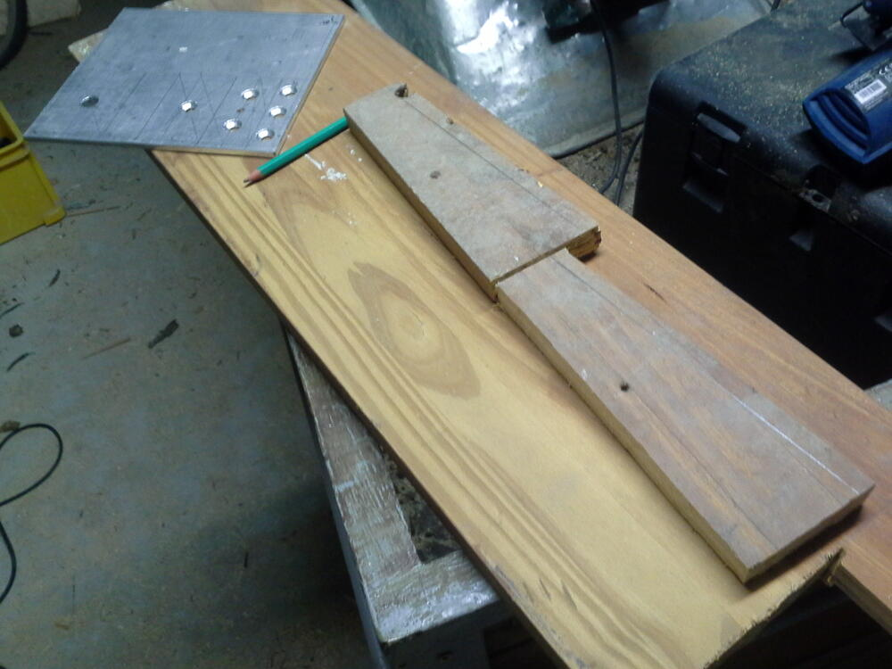
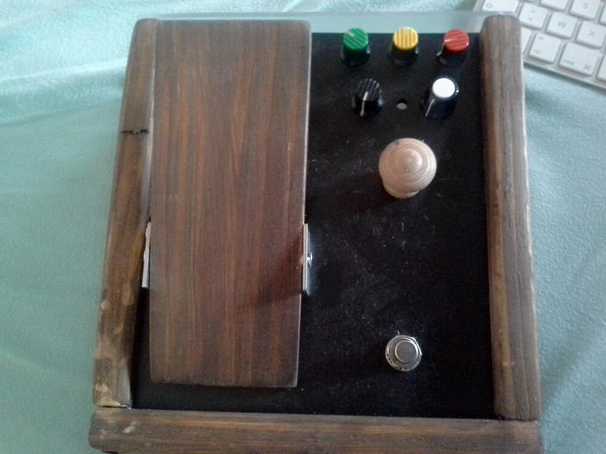

Summary
-------

A programmable guitar/bass effects pedal, based on the excellent [Spin semi FV-1](http://www.spinsemi.com/products.html) DSP chip.  

I was just starting playing bass, and dubstep was all the rage in 2013, and I wanted a way to achieve the bass growl/vibrato effect with a real bass and an effects pedal.  

So I looked around and found the FV-1 chip, and decided to try myself at making a multi-effect guitar/bass pedal.

Specs
-----

- SpinSemi FV-1 "analog" DSP chip
- Double program EEPROMs
- Attiny13 to switch DSP programs and toggle banks
- Rotary switch to control Attiny13
- LM358 input stage with gain control
- LM358 output stage with volume control

[Schematic ZIP](fv_schematic.zip)  
[Proteus project ZIP](fv_proteus.zip)

Design
------

I had used Elecrow for the PCBs of my previous project an was pretty satisfied of the result, so when they had an offer, I jumped on it. I don't remember the price, but at the time it was substantially lower than the other fab houses.  
I just had to design in less than 50x50mm.

The teachers at my tech school were using [Proteus 7](https://www.labcenter.com/pcb/) (I think? or an early v8 maybe) and had an unlimited license lying around. Around the same time, I was looking for another design package, I had a few usability issues with Eagle, and had tried KiCad a few years ago and it was just awful at the time. So I decided to try this project with Proteus.

I had just bought my soldering (hot air+iron) station, and was pretty happy to use it ! The PCB turned out pretty nice, except for a mirrored 3V LDO (fixed by using another part).

With a bonus picture of my workshop :)

The program selector was a rotary switch with different resistor values, making it a [potentiometer-with-extra-steps](https://knowyourmeme.com/memes/well-that-sounds-like-slavery-with-extra-steps), and was read by the attiny's ADC. It worked ok during my tests with an Arduino pro mini:

I wanted to have an expression pedal on the cheap, so buying an off the shelf enclosure was out of the question.

I figured I'd go with a simple hinge, with a magnet on the swinging end, and an analog hall sensor + signal conditioning circuit on the chassis. I never got that far, as the PCB had a few show-stopping mistakes:
- To save space I did not follow the layout considerations for the FV1 chip to the letter -> the result: way too much static noise
- Also, I selected the attiny's gpios for an easier layout, and one was pulling the reset line high -> To be able to program the chip, I had to remove a resistor, program, and solder it back on. Pretty cumbersome if you ask me.

Because of these issues and the fact that I hadn't figured how to load custom programs from the SDK to the EEPROMs, I moved on and finally decided to solder and program the [GuitarFM](../guitarfm) v1 PCB and components I had laying around for close to a year.

A simple reverb test (default programs):


Enclosure build
---------------

I had built the enclosure before receiving the pcbs.  The enclosure is made out of wood and aluminium.

Project future
--------------

I guess, if I revisit this project, it'll be a mashup of this and the GuitarFM project, i.e. add reverb/tube distortion to the transmitter.
I still want to create a multi-effect programmable pedal, but I think I'll go with a either a cortex-M4 or an Analog devices DSP when I get around to it.