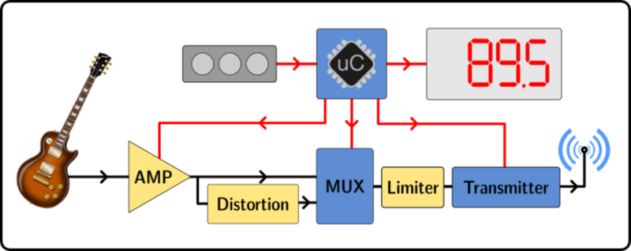
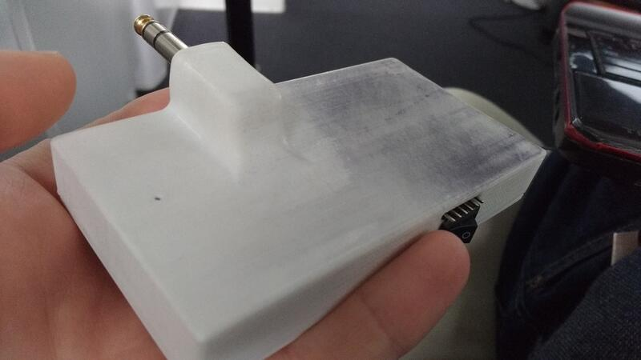

Summary
-------

An FM transmitter, just like the ones used for hearing your mp3 player's music on your old car radio, but made for using with an electric guitar.  
I made 3 revisions of the design:
1. A cobbled-together proof of concept with breakout boards and perfboard, I did not take any pictures sadly
2. A first pcb, with a preamp, 7-char LED display, and bypass-able diode distortion, but badly routed and suffers from noise issues
3. A second pcb, adding a photoresistor preamp gain control, analog limiter, and lipo charger / psu, that works pretty okay

Rev 3
-----
Components:
- uC: atmega328p
- FM tx: si4713
- Preamp: AD822
- Gain control: LED + LDR + I2C pot (MCP4017)
- Analog limiter circuit
- Display: LED 7-segment x4 + TLC59282 driver
- Control: 3 tactile switches (TL-3315)

[Schematic PDF](guitarfm_v2.pdf)  
[Kicad project ZIP](gfm_kicad.zip)  
[BOM](gfm_bom.ods)

A block diagram:

The PCB was designed and routed in KiCad (git version from 2015), but I had a few issues:
1. I forgot to retrigger the zone fills after moving 3 vias, that caused a direct short between the VCC and GND layers
2. I accidentally specified the mounting holes as plated in the gerbers and got a nice fat short between the VCC and GND layers, again
3. I got the VCC (3.3V) regulator footprint mirrored, so I got to solder the component dead-bug style
4. And I ordered the wrong regulator (4.5V instead of 3.3V) on Digikey, and fried 3 of my expensive FM transmitter chips because of that
5. I had gotten a fancy PMIC (which turns out wasn't needed after all) and it wouldn't power my board no matter what

All avoidable errors, and from now on, I'm putting 0-ohms after all regulators so I can test them before powering the whole board. Also I think KiCad now auto-triggers zone fills before gerber exports.

Fixes:  
1\. Drilled through the vias and connected the tracks with enamel wire  
2\. Removed just the plated ring on top and bottom with a cone dremel bit  
3\. (and 4): I had a 3.3V linear regulator lying around, so a bit of glue and loose wiring made it work  
5\. After re-reading the datasheet I soldered a 10k resistor, and bridged a pin and the board powered up

Body
----
I used Solidworks to model the body for the pcb. I printed the body and buttons at my university [makerspace](https://fablab.univ-tlse3.fr/wiki/index.php/Accueil) on a makerbot printer.  

I didn't have a good kicad-solidworks workflow back then, so in summary, I took the pcb's dimensions and mouting hole locations with a caliper and modeled only the pcb (no components) in solidworks and modeled the case around it. The case printed right-ish the first time (a bit of warping on the top), it was printed in white PLA.

For the buttons, I did a little adding and subtracting of the case height, tactile switch height and FR4 width and with a little trial and error (and cursing at the printer's not-so-consistent tolerance) managed to print it right after only 4 times (yay!).

For fitting the 1/4in jack I first soldered the signal wires, then heated up the hole in the PLA (\~100°C) and force-screwed it in, warping it a little bit, but now it's firmly attached.

PCB
---
The pcb was laid out in an older kicad version, and since the [fab house](https://www.elecrow.com/pcb-manufacturing.html) didn't make me pay for silkscreening the back, I added a nice guitar decal :D  
The schematic has older kicad symbols so ther will be import issues with KiCad 5, but nothing too terrible.  

I was pleasantly surprised with KiCad v4's usability/stability improvements, and decided to use KiCad for all future projects (I previously used Eagle, and tried Proteus too).  
I really enjoyed using my mouse, a razer [Naga 2014](https://support.razer.com/gaming-mice-and-mats/razer-naga/), with all the button mapped to actions (e.g. place via, switch layer, start trace, enter, delete, move). I modified a script I found online (don't remember where), but anyway [here it is](naga.sh).

I had a few design & layout mistakes, as explained earlier, in the two pictures below, you can see that I changed the preamp circuit: the op-amp had a too large gain value, so converted it to a two-stage preamp.  
I also had problems with the two clamping diodes filtering the signal (I put leds to get a bigger Vf), so had to remove them.  
The limiter and distortion circuits seem to work at least, so I have that going for me which is nice. 

As the LDR+diode module was not available on Digikey, I forgot to buy it and so I had to set the gain with a resistor in a pinch. and then I forgot about it, so that part of the circuit isn't tested either.

You can also see the antenna wire sticking out of the case, as I didn't take the time to put it back nicely in the case each time.

Reflow time !  
I ordered a stencil along the PCBs, and applied paste with my uni card. Then, I placed the components one by one with tweezers.  

Then, the real fun: I put the board on an old pan, and used my parents' gas cooktop to reflow the board, adjusting power while checking the temp with a cheap IR gun.

After a few touch-ups with the iron, and fixing the previous design issues, the board powered up !

Code
----
The whole thing is programmed with Arduino and I'm using Adafruit's [Si4713 library](https://github.com/adafruit/Adafruit-Si4713-Library) to control the FM TX.
I modified the library to enable AGC though.

Using the interface, one can change the frequency, enable/disable diode distortion, adjust input gain, and save the current settings to flash.

[Arduino project ZIP](gfm_code_20160102.zip) and [Library folder](arduino_libs.zip)

The program is a simple polling/refresh loop, I didn't bother using interrupts or put the uC to sleep.  
I did one thing to get better battery life though: After a timeout, there is a "screensaver" function, a simple one-led-at-a-time animation so I don't drain the battery leaving the display on.

I'll add a video to this page eventually, when I get my hands on an FM radio.

Previous revisions
------------------

The v2 was made in Eagle v6 light and was 100x100mm with a trace antenna.  
It had a bit more noise than the v2, a bit due to me putting the PSU right next to the signal trace, I didn't know any better back then.  
I was learning how to solder smd by hand so the joints are a bit ugly, but good enough.  
This version used a rotary encoder for the interface

A few pictures:

Project future
--------------

I initially wanted to sell these, so a redesign was planned, but let's be honest, who has an FM radio at home anymore ? 

Anyway, if I do revisit this project, I have a few upgrades planned:
- A better input stage
- Integrate an [FV1 chip](http://www.spinsemi.com/products.html) from spinsemi for distortion & reverb
- A battery gauge