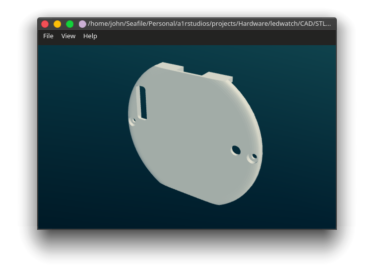
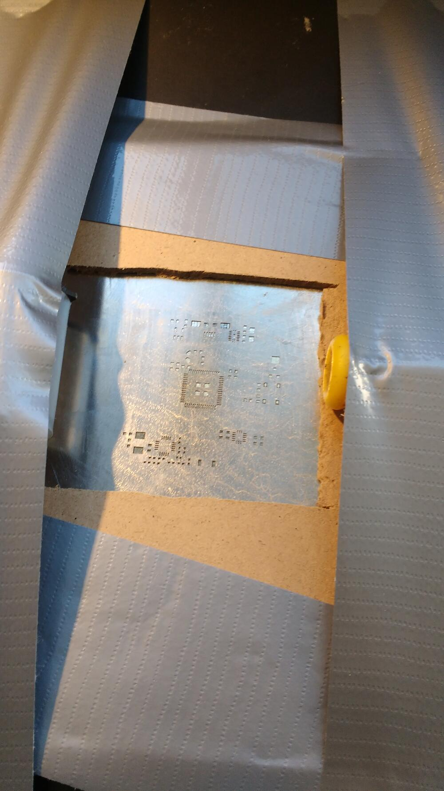

Summary
-------

A simple binary led watch. Programmed in bare-metal C (i.e. no HAL), uses a MSP430 uC and 24 green leds.

Features:
- 16-bit ultra low power uC
- 32k watch crystal
- High-brightness green led display
- Ultra low power accelerometer
- 2.4GHz low power transceiver
- LiPo charger w/ uUSB connector
- 1x reset/setup button
- Motor driver (single FET)

Specs
-----

Components:
- uC: [MSP430F5247](http://www.ti.com/product/MSP430F5247)
- 2.4GHz TRX: [nRF24L01+](https://www.digikey.com/catalog/en/partgroup/nrf24l01/44008)
- Leds: [150141VS73100](https://www.digikey.com/product-detail/en/w-rth-elektronik/150141VS73100/732-5002-1-ND/4489970) (2V green)
- Accelerometer: [LIS3DH](https://www.st.com/en/mems-and-sensors/lis3dh.html)
- Charger: [MCP73812](https://www.microchip.com/wwwproducts/en/MCP73812)
- Regulator: [TPS62742](http://www.ti.com/product/TPS62742)
- Pusbutton: [TL-3315](https://www.e-switch.com/product-catalog/tact/product-lines/tl3315-series-low-profile-smt-tactile-switch)
- Dev kit/Programmer: [MSP-EXP430F5529LP](http://www.ti.com/tool/MSP-EXP430F5529LP)

[Schematic PDF](lw_schematic.pdf)  
[Kicad project ZIP](lw_kicad.zip)  
[BOM](lw_bom.ods)  
[3D STL ZIP](lw_stl.zip)  
[Code ZIP](lw_code.zip)

Timeline
--------

I was at the end of my master's in Embedded Electronics, and needed an internship ASAP.  
I had an interview in early september but was not selected and after asking the HR person, the reason was that I didn't seem properly motivated to them.  

So in early october, I set out to build a project that was small enough to bring to interviews that highlighted my electronics skills.  
So I built a binary watch.

The design was rushed and not documented at all, but I had something that blinked in \~3 weeks, excluding pcb turnaround. 

I was still programming display code minutes before taking the bus to a job/internship fair, but the watch grabbed the attention of a hardware startup's team and got me my internshin (and a job promise) the next week.

It seems the project did its job successfully ! 

So back into the drawer it went, until \~1 year after when I needed to land a new job and the code saw a bit of debugging and new features.  
And back inte the drawer it went, again, for 6 months until christmas break when I modeled a body to be actually able to wear it as an actual watch.

Now the project is paused again, because I started working on the next revision (see [M-watch](../mwatch)).

Design
------

The watch drives a time-multiplexed LED display, with a simple 1 led per GPIO control scheme. To stay within the uC's GPIO current output spec, only 3 leds are ever active at any given time.

It doesn't have buttons (except reset), and the original plan was to control it only using accelerometer tap gestures. But that fell short when the accelerometer's tap register always returned 0x00 instead of the tap direction, so now the control scheme is:
- Single button: press to toggle modes: currently BCD, digits, accel test, and time set
- Activate display: wrist shake gesture, or angle watch to face
- Set time: tilt up/down to change current number, shake Z to save and set next number

I still didn't get around to use the nRF24 transceiver \:\(

With such a rushed design, I made a few mistakes (and learned some lessons):
- Forgot to design a way to check the battery level -> means the watch can stop at any time if not charged weekly
- The motor driver circuit is missing a diode (in addition to the body diode)
- Xtal caps were redundant, as it turns out you can enable internal caps in the uC
- I set VCC to 2V (LED's Vf so I could go without resistors), with no way to change it afterwards. The problem is that I did not account for the LED duty cycle, the effect being a very dim display. This is the real dealbreaker, meaning I can't use the watch with a diffuser or outdoors. Indoors works fine though.
- I connected GPIOs for an easier layout, and when programming, saw that only a single port had the ability to trigger ISRs. Of course all my interrupt sources were connected to another port (yay!). I got around to that by using the timer's capture/compare input function to trigger an ISR from my inputs, at the expense of higher power consumption.
- I didn't plan ahead for how the battery would fit, and because of the 32k crystal had to use a smaller capacity.

The circuit was designed and laid out in KiCad v4 (and later ported to v5), and I used [StepUp tools](https://github.com/easyw/kicadStepUpMod/) to import the PCB and components into SolidWorks.  
It really helped me get the positions right for the led holes.

I printed the watch body using [Shapeways PA12](https://www.shapeways.com/materials/versatile-plastic), I was worried about the smaller features, and even got a warning from Shapeways but it came out really nice !

Unfortunately, I was migrating my self-hosted storage from Nextcloud to [Seafile](https://www.seafile.com/en/features/) (which I really recommend btw, blazing fast), and I forgot to install the Seafile client on my Windows partition. Then, thinking all my files were synced, I merrily nuked the partition. Ooops.

So I don't have the solidworks source files anymore, but still have the STLs from Shapeways print history. So no more design tweaks.

Reflow
------

Like with my previous project, I ordered a stencil and placed the components by hand.  
As always, I always make sure to use the right tool for the job ..NOT !

Using the other PCBs as spacers for the stencil:

And random stuff & duct tape for holding the stencil flat

After my adventures [reflowing on a gas stove](../guitarfm/#pcb), I upgraded my methods !
Haha nope again, the real reason is that I moved into a new dorm that had a glass-ceramic cooktop and tried using it for reflow, checking the temp periodically with an IR gun.

I placed the PCB directly on the cooktop surface, aaand.. burned my first batch ! Turns out the heating curve is not linear at all, damn!  
For the next attempt, I continuously monitored the temperature and toggled the heat on and off to stay <250°C.

This attempt worked but I still had to touch up some solder bridges, nothing the liberal application of flux can't solve !

Programming
-----------

I used a TI launchpad for programming and debugging the board.

No IDEs were harmed during development ! 

I just used a text editor ([Sublime Text](https://www.sublimetext.com/)) and a simple [makefile](lw_makefile) calling TI [MSP-GCC](http://www.ti.com/tool/MSP430-GCC-OPENSOURCE) for compilation and [mspdebug](https://github.com/dlbeer/mspdebug) for flashing and for the gdb server.

I used the gdb cli w/ the uC programming manual to debug. A bit tedious if you ask me, now I prefer to fire up eclipse along with the register definitions when I really need a debugger.

Demo
----

A quick accelerometer test, filmed when debugging I2C & display code

BCD mode:
- 4 leds per digit
- Top row: hours
- Middle row: minutes
- Bottom row: seconds



Digital mode:
- First flash: hours
- Second flash: minutes



Accelerometer test:




Project future
--------------

I wanted to build a better, smaller version of this watch, and was also toying with the idea of a modular smartwatch system, so I killed two birds with one stone and started designing a modular watch platform with a replaceable led display: [M-watch](../mwatch).

The new watch has a nRF52 core pcb and will be using an RTOS, so the current ledwatch code won't be reused for now.

But, if I decide to make a MSP430-based core pcb for the M-watch, I'll look into reusing/rewriting this code :)
