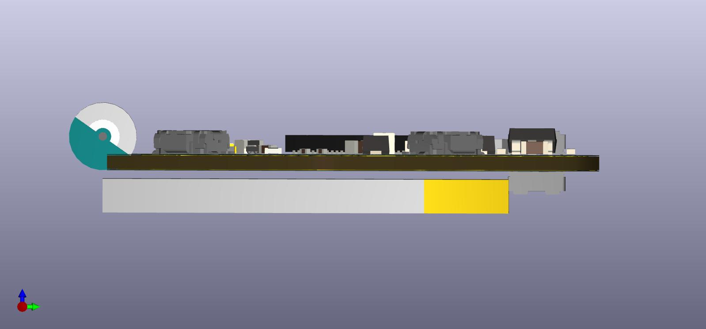
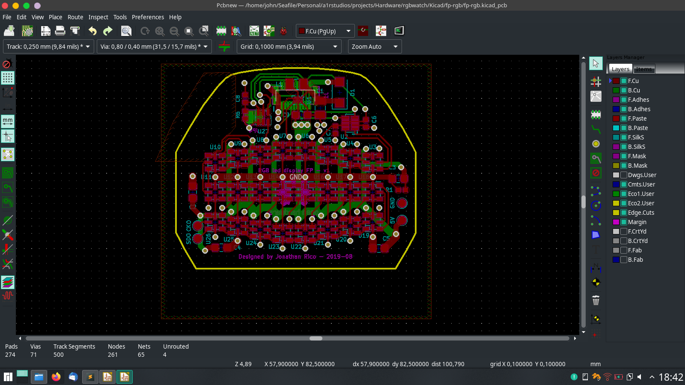
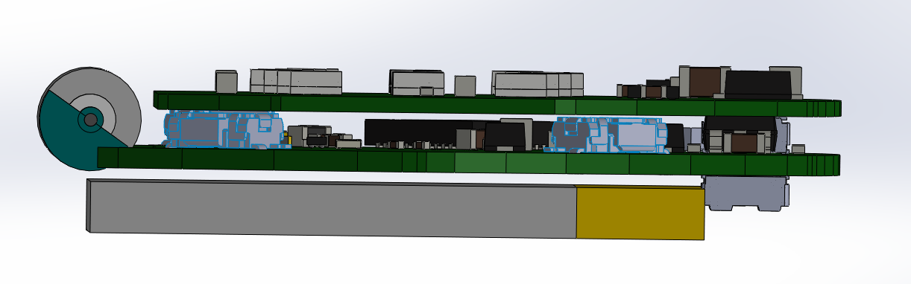
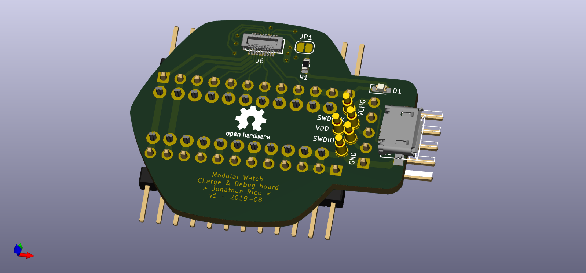

Summary
-------

Designed as a follow-up to [Ledwatch](../ledwatch).

A modular (smart)watch system. The concept is splitting modern smartwatch functions into modular PCBs with mezzanine connectors, to be able to try different sensor/mcu/display combos without having to redesign everything from scratch each time.  

A minimum system would be 2 boards: core board + display board. This is what I have begun designing, with a nRF52-based core board and a serial RGB led display board.

But one can imagine for example:
1. Top board: Color LCD + driver, NFC transceiver + coil
2. Middle board: ARM SoC w/ BLE & secure coprocessor, IMU
3. Bottom board: Heart-rate sensor, wireless charger
4. LiPo battery

Or for a lower-power system:
1. Top board: Segment LCD
2. Middle board: MSP430 MCU, low power accelerometer
3. Lithium coin cell

The one I'm building right now:
1. Top: 24 RGB leds, 5V DCDC, ambient light sensor
2. Middle: ARM SoC w/ BLE, 3V DCDC, accelerometer, Motor driver, LiPo charger
3. LiPo battery

Specs
-----

Components:
- BLE SoC: [nRF52832](https://www.nordicsemi.com/Products/Low-power-short-range-wireless/nRF52832)
- Leds: [APA102-2020](https://www.adafruit.com/product/3341)
- Accelerometer: [LIS3DH](https://www.st.com/en/mems-and-sensors/lis3dh.html)
- Charger: [bq21040](http://www.ti.com/product/BQ21040)
- Core DCDC: [TPS62743](http://www.ti.com/product/TPS62743) (mistake in schematic it seems)
- LED DCDC: [TPS610997](http://www.ti.com/product/TPS61099) (5V fixed)
- 3-5V level shifter: [NTB0102GF,115](https://www.digikey.com/product-detail/en/nxp-usa-inc/NTB0102GF115/568-5570-1-ND/2531048)
- Tactile switches: [EVQ-P3401P](https://www3.panasonic.biz/ac/e/search_num/index.jsp?c=detail&part_no=EVQP3401P)
- Pusbuttons: [Casio F-91W](https://en.wikipedia.org/wiki/Casio_F-91W) (using just the buttons & mini o-rings)
- Ambient light sensor: [APDS-9306-065](https://www.broadcom.com/products/optical-sensors/ambient-light-photo-sensors/apds-9306-065)
- Motor driver: [LC898302AXA](https://www.onsemi.com/products/power-management/motor-drivers/motor-drivers-brushless/lc898302axa)
- Load switches: [FPF1203LUCX](https://www.onsemi.com/products/power-management/load-switches/fpf1203l)
- Battery: 125mAh LiPo
- Connector female: [513380274](https://www.digikey.com/product-detail/en/molex/0513380274/WM3353CT-ND/2405694)
- Connector male: [559090274](https://www.digikey.com/product-detail/en/molex/0559090274/WM3450CT-ND/2405679)
- Devkit & programmer/debugger: [nRF52-DK](https://www.nordicsemi.com/Software-and-Tools/Development-Kits/nRF52-DK)

Project files: (as-is, pcbs have not been built yet)

Core board:  
[Schematic PDF](pdf/rgbw.pdf)  
[Kicad project ZIP](zip/rgbw.zip)

Display board:  
[Schematic PDF](pdf/fp-rgb.pdf)  
[Kicad project ZIP](zip/fp-rgb.zip)  

Charger/Debug board:  
[Schematic PDF](pdf/chg-rgb.pdf)  
[Kicad project ZIP](zip/chg-rgb.zip)  

Board assembly:
[Exploded view PDF](pdf/assembly.pdf)

Mechanical
----------

The body was designed in SolidWorks, I tried another workflow for designing the PCB & enclosure:

1. Sketch out watch shape in [Inkscape](https://inkscape.org/)
2. Create rough component shape to test fit
3. Refine watch shape
4. Design schematic in KiCad
5. Import watch shape in KiCad layout
6. Create rough 3d models for all components
7. Place & route PCB, checking 3d view for conflicts
8. Export STEP file from KiCad layout
9. Export DXF from inkscape
10. Import STEP of the two PCBs in SolidWorks
11. Test fit of PCBs
12. Import DXF in SolidWorks, sketch a rough watch body volume
13. Align PCB models with watch body
14. Finish designing watch body

Again, printed at shapeways, and the models seems to fit quite nicely, I guess we'll see for sure when I actually build it entirely !

[Assembly STEP file](3d/watch_assembled.step)



Having the (rough) 3d models of the component was very helpful for two reasons: 
- I could verify that my footprints were correct
- It really helped for component placement.

To be able to quickly generate package models, I finally bit the bullet, learned a bit of [OpenSCAD](https://www.openscad.org/), and created basic shapes (BGA, DFN, QFN) that could be easily reprogrammed. You can download the small library I made for this project here:  
[OpenSCAD source files ZIP](3d/openscad.zip)

Core board
----------

Display board
-------------

display & core connected:

Debug board
-----------

Project status
--------------

Due to my recent job change & relocation to Norway, I had to give away some essential tools before leaving (limited space in suitcases), and as such, this project is now on pause.

I will try to get a headstart on programming though, as it doesn't require any hardware except the dev kit which I already have.

Things to do:
- Finish cradle 3d model
- Print cradle
- Send the PCBs to fab
- Finish the BOM
- Buy the components
- Reflow the components (farewell my soldering station..)
- Test & bring-up the core board
- Test the display board
- Program the watch
- Make a small android companion app